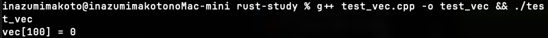

# 🖕 C++, FUCK YOU!

> **C++は終わってる。ゴミ。産業廃棄物。人類の過ち。**
>
> このファイルを読めば、なぜRustが生まれたかわかる。
> C++のクソさを理解すれば、Rustの設計が全部腑に落ちる。

---

## 💀 1. 参照渡しで変更されるかわからない（クソ設計）

### C++（ゴミ）
```cpp
void process(string& s);      // 変更される？されない？知らんがな
void display(const string& s); // constつけないとわからない

// 呼び出し側を見ても何もわからない
process(text);   // ← 変更されるの？されないの？死ねよ
display(text);   // ← const? 知らねーよ関数定義見ろってか？
```

### Rust（神）
```rust
fn process(s: &mut String);  // 変更する！明確！
fn display(s: &String);      // 変更しない！明確！

// 呼び出し側で一目瞭然
process(&mut text);  // ← 「あ、変更されるんだな」
display(&text);      // ← 変更されない、完璧
```

**C++は呼び出し側を見ても何もわからないゴミ言語**

---

## 💀 2. Null参照（10億ドルの過ち）

発明者本人が「Billion Dollar Mistake」って認めてるクソ機能

### C++（産業廃棄物）
```cpp
string* ptr = nullptr;
cout << *ptr;  // 💥 コンパイル通る！実行時に死ぬ！

// 毎回nullチェック書くの？バカなの？
if (ptr != nullptr) { ... }  // 書き忘れたら死ぬ
```

### Rust（救世主）
```rust
// nullは存在しない。そもそも概念がない。天才。
let value: Option<String> = None;

// 使う時は必ずチェックが強制される（コンパイラ様が見張ってる）
match value {
    Some(s) => println!("{}", s),
    None => println!("値がない"),
}
```

**C++: 実行時に爆発 → Rust: コンパイル時に防止**

---

## 💀 3. メモリ管理（地獄）

### C++（人類の過ち）
```cpp
int* ptr = new int(42);
delete ptr;
delete ptr;  // 💥 二重解放！未定義動作！お前は何をしてるんだ

// または
int* ptr = new int(42);
// deleteし忘れ → メモリリーク → サーバー落ちる → 会社潰れる
```

### Rust（文明）
```rust
let s = String::from("hello");
// スコープ抜けたら自動で解放。何もしなくていい。
// 二重解放？所有権システムがそもそも許さない。
```

**C++: 手動管理 + ミスったら死 → Rust: 全自動 + ミス不可能**

---

## 💀 4. データ競合（デバッグ地獄）

### C++（終わってる）
```cpp
// 複数スレッドから同じデータにアクセス
// → コンパイル通る
// → 実行時にたまにクラッシュ
// → 再現しない
// → 3日徹夜でデバッグ
// → 精神崩壊
```

### Rust（希望の光）
```rust
// コンパイル時に検出！実行する前にエラー！
// 「Send」「Sync」トレイトで安全性を数学的に証明
// そもそも危険なコードが書けない
```

**C++: 実行時爆弾 → Rust: コンパイル時に爆弾処理**

---

## 💀 5. switch文のfall-through（罠）

### C++（設計ミス）
```cpp
switch (x) {
    case 1:
        doSomething();
        // break忘れた！気づかない！レビューも通る！
    case 2:
        doOther();  // ← 勝手に実行される、意味不明
        break;
}
// なんでデフォルトで落ちるんだよ。誰がそんな設計した？
```

### Rust（まとも）
```rust
match x {
    1 => do_something(),  // 自動で止まる。当たり前。
    2 => do_other(),
    _ => {},
}
```

**C++: 罠だらけ → Rust: まともな設計**

---

## 💀 6. 依存関係管理（発狂）

### C++（中世）
```bash
# ライブラリ追加したい？覚悟しろ。

# 1. 公式サイトからダウンロード（どこ？）
# 2. ビルド（CMake？Make？なにそれ）
# 3. インクルードパス設定（どこに書くの？）
# 4. ライブラリパス設定（え、別？）
# 5. Makefile/CMakeLists.txt修正（意味不明な構文）
# 6. 依存の依存も同じ手順...（無限地獄）
# 7. バージョン違いでビルド通らない
# 8. 3時間溶ける
# 9. 泣く
```

### Rust（現代）
```toml
[dependencies]
rand = "0.8.3"
```
```bash
cargo build  # 終わり。全部自動。神。
```

**C++: 地獄 → Rust: 天国**

---

## 💀 7. 配列範囲外アクセス（未定義動作祭り）

### C++（カオス）

**警告は出るけどコンパイル通る！実行もされる！頭おかしい！**

```cpp
int arr[5] = {1, 2, 3, 4, 5};
std::cout << arr[100] << std::endl;  // 警告出るけど通る！実行される！

std::vector<int> vec = {1, 2, 3, 4, 5};
std::cout << vec[100] << std::endl;  // 警告すら出ない！ゴミ値！でも動く！
```



**結果: `vec[100] = 0`** ← ゴミ値返して平然と動き続ける。狂気。

| アクセス方法 | 何が起きる |
|-------------|-----------|
| `arr[100]` | 警告出るけど動く、ゴミ値を返す |
| `vec[100]` | 警告なし！ゴミ値 or クラッシュ（運次第） |
| `vec.at(100)` | 例外（でも誰も使わない、遅いから） |

### Rust（正気）

```rust
let arr = [1, 2, 3, 4, 5];
println!("{}", arr[100]);  // パニック！安全に停止！原因も明確！

// 安全にアクセスしたいなら
if let Some(value) = arr.get(100) {
    println!("{}", value);
} else {
    println!("範囲外！");
}
```

**C++: 壊れたまま動く → Rust: 壊れたら止まる（当たり前）**

---

## 📊 まとめ: C++終わってる度

| 問題 | C++ | Rust |
|------|-----|------|
| 参照の変更可否 | わからん（ゴミ）| `&mut` で明確 |
| Null | 実行時💥（クソ）| コンパイル時に防止 |
| メモリ管理 | 手動🔥（地獄）| 自動（所有権） |
| データ競合 | 実行時💥（終）| コンパイル時に防止 |
| switch | 罠だらけ（設計ミス）| 安全 |
| 依存管理 | 発狂（中世）| Cargo神 |
| 配列範囲外 | 未定義動作💀（狂気）| パニック（正気） |

---

## 🦀 結論

> **C++で苦しんだ人たちが「もう二度とあんな思いはしたくない」と作った言語、**
> **それがRust。**

C++は人類の過ち。Rustは人類の希望。

**C++, FUCK YOU!** 🖕
