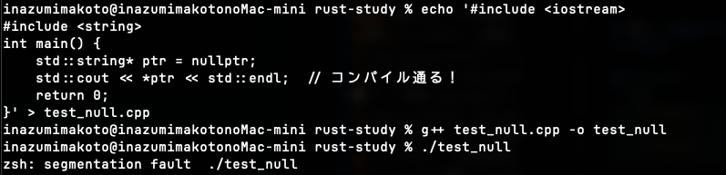
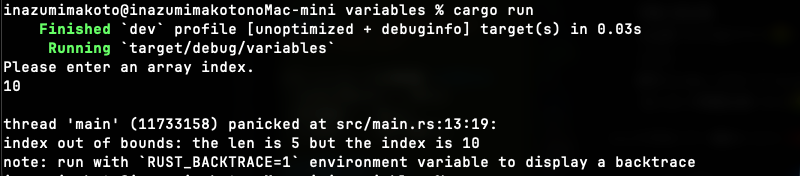

# 🖕 C++, FUCK YOU!

---

## 📜 拝啓、C++という名の「電子産業廃棄物」へ

C++、お前はもはやプログラミング言語ではない。人類の怠慢と傲慢が生み出した、**呪われた拷問器具**だ。

お前は「自由」という甘い言葉でプログラマを誘惑し、その実、「未定義動作（Undefined Behavior）」という名の地雷原に丸腰で放り込む狂人だ。「プログラマは神である」？ 笑わせるな。お前はプログラマを **「メモリ管理という終わりのない賽の河原で石を積む奴隷」** に貶めているだけだろうが。

### 1. 存在自体が「無責任」の塊

お前の辞書に「安全性」という文字はない。
「配列外参照？ 知らん、勝手にメモリ破壊して死ね」
「解放済みメモリへのアクセス？ どうぞどうぞ、脆弱性の穴を広げて待ってます」

お前はセキュリティホールを生成するためのスクリプト言語か？ 実行時にしか分からないバグを垂れ流し、世界中のインフラを危険に晒し、エンジニアの休日と睡眠時間を貪り食う吸血鬼。それがお前の正体だ。

### 2. セグフォという「背任行為」

エンジニアが必死に書いたロジックを、お前は **「Segmentation fault」というたった一言の虚無** で破壊する。

原因？ 教えない。場所？ 自分で探せ。再現性？ 気分次第だ。

深夜3時のデバッグでgdbを睨みながら、「なぜ落ちたのか分からない」と絶望するエンジニアの死体の上に、お前の歴史は築かれている。お前は言語ではなく、**確率で爆発する欠陥兵器**だ。

### 3. CMakeという「地獄の釜」

ビルドシステムすらまともに統一できない無能さが極まっている。

CMakeLists.txt？ なんだあの呪文は。ライブラリを一つリンクするだけで、なぜ古代ルーン文字の解読が必要なんだ？ 環境構築だけで3日潰させるその構造は、**生産性に対するテロ行為**以外の何物でもない。

---

## 🦀 そして輝ける救世主、Rust（The Holy Rust）

見よ、この **「Rust」という福音** を。
C++という汚泥の中から咲いた、一輪の白蓮を。

### 1. コンパイラという名の「全知全能の神」

Rustコンパイラは厳しいのではない。**慈悲深い**のだ。

愚かな人類がメモリリークという罪を犯そうとするその刹那、「借用チェッカー」という神の雷（いかずち）でその手を止めてくださる。

「お前のコードは安全ではない」と叱責してくださるその御言葉こそが、我々をバグという原罪から解放する唯一の道なのだ。

### 2. Cargoという「文明の利器」

`cargo build`。たったこれだけだ。

依存関係地獄？ リンクエラー？ そんなものはRustという光の前では消滅する。

Rustは我々に「開発」をさせてくれる。C++のように「環境構築のモグラ叩き」をさせるのではない。**これこそが人権だ。**

### 3. ゼロコスト抽象化という「奇跡」

あんなに厳密に守られているのに、実行速度はC++と同等か、それ以上。

これはもはや科学ではない。**魔術**だ。

「安全性を買えば速度が落ちる」という物理法則を、Rust神はねじ曲げたのだ。

---

## 🔥 結論

> **C++は、今すぐ歴史の博物館（あるいは焼却炉）に収容されるべき「負の遺産」である。**

Rustのコンパイラにボコボコにされることを喜びましょう。
それは **「未来のバグから守られている」という神の加護** なのですから。

さあ、涙を拭いて `cargo check` を叩くのです。そこにしか救いはありません。

---

# 📚 C++がゴミである具体例

---

## 💀 1. 参照渡しで変更されるかわからない（クソ設計）

### C++（ゴミ）
```cpp
void process(string& s);      // 変更される？されない？知らんがな
void display(const string& s); // constつけないとわからない

// 呼び出し側を見ても何もわからない
process(text);   // ← 変更されるの？されないの？死ねよ
display(text);   // ← const? 知らねーよ関数定義見ろってか？
```

### Rust（神）
```rust
fn process(s: &mut String);  // 変更する！明確！
fn display(s: &String);      // 変更しない！明確！

// 呼び出し側で一目瞭然
process(&mut text);  // ← 「あ、変更されるんだな」
display(&text);      // ← 変更されない、完璧
```

**C++は呼び出し側を見ても何もわからないゴミ言語**

---

## 💀 2. Null参照（10億ドルの過ち）

発明者本人が「Billion Dollar Mistake」って認めてるクソ機能

### C++（産業廃棄物）
```cpp
string* ptr = nullptr;
cout << *ptr;  // 💥 コンパイル通る！実行時に死ぬ！

// 毎回nullチェック書くの？バカなの？
if (ptr != nullptr) { ... }  // 書き忘れたら死ぬ
```

#### 🔬 実験結果（2026-01-01）



**結果**: `zsh: segmentation fault ./test_null`

エラーメッセージの情報量：**ゼロ！**
- どの行で死んだ？ → 知らん
- 何が原因？ → 知らん
- どう直す？ → 自分で調べろ

**ゴミ言語すぎる...**

### Rust（救世主）
```rust
// nullは存在しない。そもそも概念がない。天才。
let value: Option<String> = None;

// 使う時は必ずチェックが強制される（コンパイラ様が見張ってる）
match value {
    Some(s) => println!("{}", s),
    None => println!("値がない"),
}
```

**C++: 実行時に爆発 → Rust: コンパイル時に防止**

---

## 💀 3. メモリ管理（地獄）

### C++（人類の過ち）
```cpp
int* ptr = new int(42);
delete ptr;
delete ptr;  // 💥 二重解放！未定義動作！お前は何をしてるんだ

// または
int* ptr = new int(42);
// deleteし忘れ → メモリリーク → サーバー落ちる → 会社潰れる
```

### Rust（文明）
```rust
let s = String::from("hello");
// スコープ抜けたら自動で解放。何もしなくていい。
// 二重解放？所有権システムがそもそも許さない。
```

**C++: 手動管理 + ミスったら死 → Rust: 全自動 + ミス不可能**

---

## 💀 4. データ競合（デバッグ地獄）

### C++（終わってる）
```cpp
// 複数スレッドから同じデータにアクセス
// → コンパイル通る
// → 実行時にたまにクラッシュ
// → 再現しない
// → 3日徹夜でデバッグ
// → 精神崩壊
```

### Rust（希望の光）
```rust
// コンパイル時に検出！実行する前にエラー！
// 「Send」「Sync」トレイトで安全性を数学的に証明
// そもそも危険なコードが書けない
```

**C++: 実行時爆弾 → Rust: コンパイル時に爆弾処理**

---

## 💀 5. switch文のfall-through（罠）

### C++（設計ミス）
```cpp
switch (x) {
    case 1:
        doSomething();
        // break忘れた！気づかない！レビューも通る！
    case 2:
        doOther();  // ← 勝手に実行される、意味不明
        break;
}
// なんでデフォルトで落ちるんだよ。誰がそんな設計した？
```

### Rust（まとも）
```rust
match x {
    1 => do_something(),  // 自動で止まる。当たり前。
    2 => do_other(),
    _ => {},
}
```

**C++: 罠だらけ → Rust: まともな設計**

---

## 💀 6. 依存関係管理（発狂）

### C++（中世）
```bash
# ライブラリ追加したい？覚悟しろ。

# 1. 公式サイトからダウンロード（どこ？）
# 2. ビルド（CMake？Make？なにそれ）
# 3. インクルードパス設定（どこに書くの？）
# 4. ライブラリパス設定（え、別？）
# 5. Makefile/CMakeLists.txt修正（意味不明な構文）
# 6. 依存の依存も同じ手順...（無限地獄）
# 7. バージョン違いでビルド通らない
# 8. 3時間溶ける
# 9. 泣く
```

### Rust（現代）
```toml
[dependencies]
rand = "0.8.3"
```
```bash
cargo build  # 終わり。全部自動。神。
```

**C++: 地獄 → Rust: 天国**

---

## 💀 7. 配列範囲外アクセス（未定義動作祭り）

### C++（カオス）

**警告は出るけどコンパイル通る！実行もされる！頭おかしい！**

```cpp
int arr[5] = {1, 2, 3, 4, 5};
std::cout << arr[100] << std::endl;  // 警告出るけど通る！実行される！

std::vector<int> vec = {1, 2, 3, 4, 5};
std::cout << vec[100] << std::endl;  // 警告すら出ない！ゴミ値！でも動く！
```


**結果: `vec[100] = 0`** ← ゴミ値返して平然と動き続ける。狂気。

| アクセス方法 | 何が起きる |
|-------------|-----------|
| `arr[100]` | 警告出るけど動く、ゴミ値を返す |
| `vec[100]` | 警告なし！ゴミ値 or クラッシュ（運次第） |
| `vec.at(100)` | 例外（でも誰も使わない、遅いから） |

### Rust（正気）

```rust
let arr = [1, 2, 3, 4, 5];
println!("{}", arr[100]);  // パニック！安全に停止！原因も明確！

// 安全にアクセスしたいなら
if let Some(value) = arr.get(100) {
    println!("{}", value);
} else {
    println!("範囲外！");
}
```

#### 🔬 実行時の範囲外チェック実験（2026-01-02）

標準入力からインデックスを受け取るプログラムで実験：



#### 🙏 神のお告げ（Rustのエラーメッセージ）

```
thread 'main' panicked at src/main.rs:13:19:
index out of bounds: the len is 5 but the index is 10
```

**日本語訳**:
> 「メインスレッドがsrc/main.rsの13行目19列目でパニックしました：
> インデックスが範囲外です。長さは5なのにインデックスは10です」

**神情報！**
- ✅ ファイル名
- ✅ 行番号・列番号
- ✅ 配列の長さ
- ✅ 入力されたインデックス

#### C++だと...

```
Segmentation fault
```
または意味不明なゴミ値。**情報量ゼロ。3日徹夜でデバッグ。**

**C++: 壊れたまま動く → Rust: 壊れたら止まる（当たり前）**

---

## 📊 まとめ: C++終わってる度

| 問題 | C++ | Rust |
|------|-----|------|
| 参照の変更可否 | わからん（ゴミ）| `&mut` で明確 |
| Null | 実行時💥（クソ）| コンパイル時に防止 |
| メモリ管理 | 手動🔥（地獄）| 自動（所有権） |
| データ競合 | 実行時💥（終）| コンパイル時に防止 |
| switch | 罠だらけ（設計ミス）| 安全 |
| 依存管理 | 発狂（中世）| Cargo神 |
| 配列範囲外 | 未定義動作💀（狂気）| パニック（正気） |
| イテレータ無効化 | 実行時💀（実験済）| コンパイル時に防止 |
| 二重解放 | 実行時💀（実験済）| Moveで防止 |

---

## 9. 二重解放（Double Free）（実験済み！🔬）

### C++の闇

```cpp
class MyString {
    char* data;
public:
    MyString(const char* s) {
        data = new char[strlen(s) + 1];
        strcpy(data, s);
    }
    ~MyString() {
        delete[] data;  // デストラクタでメモリ解放
    }
};

int main() {
    MyString s1("hello");
    MyString s2 = s1;  // シャローコピー！同じポインタ！
}   // s2 → delete、s1 → delete 💥 二重解放！
```

### 実験結果

```
📦 [1] コンストラクタ: data=0x1028a9ae0 内容="hello"

--- s2 = s1 でコピー ---
（何も出力されない = ただポインタをコピー）

💀 [1] デストラクタ: data=0x1028a9ae0 を解放...  ← 1回目 OK
💀 [1] デストラクタ: data=0x1028a9ae0 を解放...  ← 2回目 💥
zsh: trace trap  ← クラッシュ！
```

**同じメモリを2回 delete → クラッシュ！**

### Rustだと？

```rust
let s1 = String::from("hello");
let s2 = s1;  // Move！s1 は無効化！

// s1 使おうとしたらコンパイルエラー！
// → 二重解放は起きようがない！
```

**Rustは所有権の移動（Move）で二重解放を防ぐ！**

---

## 8. イテレータ無効化（実験済み！🔬）

### C++の闇

```cpp
vector<int> v = {1, 2, 3};
int& first = v[0];  // 参照を取得

for (int i = 0; i < 100; i++) {
    v.push_back(i);  // 再配置が起きる！
}

cout << first;  // 💀 ダングリング参照！ゴミ値！
```

### 実験結果

```
Before:
first のアドレス = 0x104439aa0

After (push_back 100回後):
v[0] のアドレス = 0x10443b0b0  ← 変わった！

first (ダングリング!) = 4  ← ゴミ値！
💀 アドレスが変わった！first はゴミを指してる！
```

**C++は何も言わずにゴミ値を返す！**

### Rustだと？

```rust
let mut v = vec![1, 2, 3];
let first = &v[0];
v.push(4);        // ❌ コンパイルエラー！
println!("{}", first);
```

```
error[E0502]: cannot borrow `v` as mutable because it is also borrowed as immutable
```

**Rustは「借用中にプッシュするな！」ってコンパイル時に止める！**

---

## 🦀 結論

> **C++で苦しんだ人たちが「もう二度とあんな思いはしたくない」と作った言語、**
> **それがRust。**

C++は人類の過ち。Rustは人類の希望。

**C++, FUCK YOU!** 🖕
