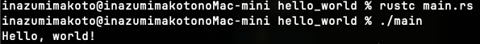

# 第1章: 入門

## 📅 学習日
2026-01-01

## 🛠 やったこと

### 1.1 インストール

```bash
curl --proto '=https' --tlsv1.2 https://sh.rustup.rs -sSf | sh
```

- `rustup`: Rustのバージョン管理ツール
- `rustc`: Rustコンパイラ
- `cargo`: パッケージマネージャ＆ビルドツール

### 1.2 Hello, World!

```rust
fn main() {
    println!("Hello, world!");
}
```

- `fn` で関数定義
- `main()` はエントリーポイント
- `println!` はマクロ（`!`がついてるのがマクロの印）

## ❓ 疑問点

- `!`がマクロ呼び出しらしいけど、見た目は関数じゃん！
  - → マクロは関数と同じルールには必ずしも従わないらしい
  - → 第19章で詳しくやるらしい（先すぎる...）

## 💡 学んだこと

- Rustのインストールは `rustup` を使う
- `println!` は関数じゃなくてマクロ（`!`がついてる）
- コンパイルしてから実行する（`rustc main.rs` → `./main`）
- 構文がC++っぽい！
  - セミコロン `;` で文が終わる
  - `{}` で囲む

## 🖥 実行結果


