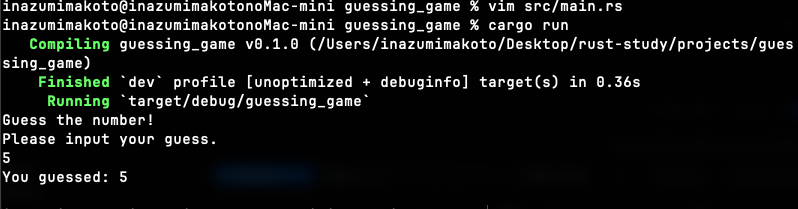
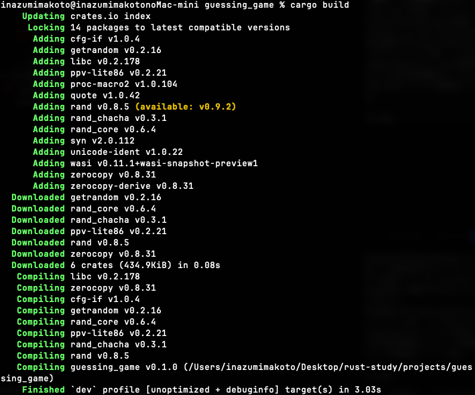
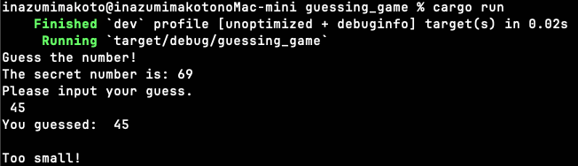
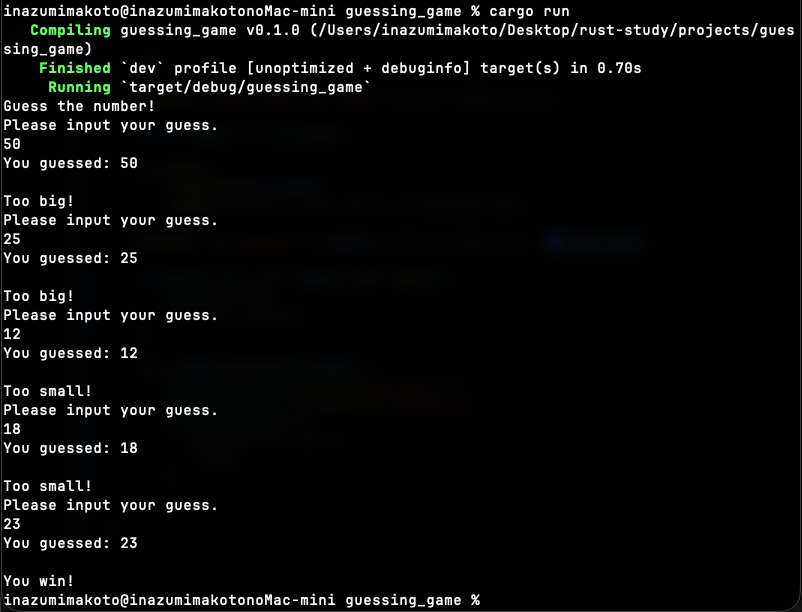

# 第2章: 数当てゲーム

## 📅 学習日
2026-01-01

## 🛠 やったこと

### 数当てのMVPを作った！



---

## 📝 学習メモ

### `use std::io`

`std` という標準ライブラリの `io` を取り込む．なんかC++みたい！！`std::cin`, `std::cout`!!

### `let mut guess = String::new();`

出ました謎構文．Rustっぽくて楽しくなってきた！

#### `let`
これは変数を作る！ってこと！

> 💡 **補足**: C++だと `int x = 5;` みたいに型を前に書くけど、Rustは `let x: i32 = 5;` みたいに型は後ろ！しかも型推論が強力だから省略できることが多い！

| 言語 | 変数宣言 | 例 |
|------|----------|-----|
| C++ | 型名 | `int x = 5;` |
| Java | 型名 (+ `var`) | `int x = 5;` / `var x = 5;` |
| JavaScript | `let` / `const` | `let x = 5;` |
| Rust | `let` | `let x = 5;` |

Rustの整数型（C++の `int` 的なやつ）:
- `i32`: 32bit符号付き（デフォルト）
- `i64`: 64bit符号付き
- `u32`: 32bit符号なし

#### `mut`
可変ってこと！デフォルトは不変（イミュータブル）だから `mut` で変えれるようにする！

ここがすごくて、C++とかはデフォが可変で不変にしたいなら `const` をつけてたけど、それが逆！

#### `String::new()`
`String` の `new` 関数を呼び出してる．簡単に言えば初期化．
だから `String` 型の空の文字列を作ってるってこと！

> 💡 **補足**: `::` は型に関連付けられた関数（関連関数）を呼ぶ。C++の `static` メソッドに近い！

---

### 標準入力

```rust
io::stdin()
    .read_line(&mut guess)
    .expect("Failed to read line");
```

#### `io::stdin()`
ユーザーからの標準入力を処理できるようにする！`std::io::stdin()` でも同じようにできる！

#### `.read_line(&mut guess)`
標準入力を `guess` にいれてる！

ここでポイント：
- 明示的に `mut` を書かなきゃいけない
- `&` で参照渡しにしてる（参照はC++でやったから大丈夫！）

##### ❓ 宣言の時に `mut` ってやってるのに、ここでも `mut` 書くのはなんで？

> 💡 **回答**: 宣言時の `mut` と参照の `&mut` は別物！
> 
> | 何か | 意味 |
> |------|------|
> | `let mut guess` | 「この変数は**再代入できる**」 |
> | `&mut guess` | 「この参照は**中身を変更できる**」 |
> 
> ```rust
> // ❌ これはダメ
> io::stdin().read_line(&guess);  // 不変参照 → 中身変えられない！
> 
> // ✅ これがOK
> io::stdin().read_line(&mut guess);  // 可変参照 → 中身変えられる！
> ```
> 
> Rustは「参照を渡す時点で『変更していいよ』と明示的に許可」させる！安全！

#### `.expect()`
入力失敗した時のエラー処理もかける！！Javaと同じような感じ．

---

### 変数を出力

```rust
println!("You guessed: {}", guess);
```

`{}` で変数を出力したい時 `println!("{}",guess);` ってやる！これはもうC!

---

### 依存関係（クレート）

#### `Cargo.toml` の `[dependencies]`

`[dependencies]` に乱数生成するライブラリ（**クレート**と呼ぶ）を記述。

```toml
[dependencies]
rand = "0.8.3"
```

- バージョン `"0.8.3"` は **0.8.3以上0.9.0未満** って表記
- 正確に0.8.3にしたいなら `"=0.8.3"` にする

#### ❓ 何も変更せずに `cargo build` するとめっちゃダウンロードしてきた。なんで？



> 💡 **回答**: `rand` クレートが**他のクレートに依存してる**から！
> 
> ```
> rand ← これだけ書いた
>   └── rand_core
>   └── rand_chacha
>   └── getrandom
>   └── libc
>   └── ... （依存の依存の依存...）
> ```
> 
> Cargoが**自動で全部の依存関係を解決**してダウンロードしてくれた！

#### `Cargo.lock`

コンパイルが成功した時にここら辺の依存関係のバージョンが書かれてる。これで再現性アップ！

#### ❓ C++の `#include` との違いは？何が便利？

| | C++ | Rust (Cargo) |
|---|-----|--------------|
| **やること** | ヘッダファイルをコピペ | パッケージ管理 |
| **ダウンロード** | 自分で入れる | 自動！ |
| **依存の依存** | 自分で管理 | 自動解決！ |
| **バージョン管理** | 地獄 | 自動！ |
| **ビルド** | Makefile地獄 | `cargo build` で終わり |

**Cargoは神！** 🦀

---

### 比較機能

#### `std::cmp::Ordering`

比較できるようにするためにインポート。

```rust
use std::cmp::Ordering;
```

#### `let guess: u32`

明示的に整数型を指定。

#### `guess.trim().parse()`

標準入力された文字列を整数にパースする。

```rust
let guess: u32 = guess.trim().parse().expect("Please type a number!");
```

- `guess` は `String` 型
- `trim()` で先頭と末尾の空白を削除 → `&str` を返す
- `parse()` で数値に変換（C++の `std::stoi` みたいな感じ）
- `expect()` でエラー時のメッセージ

#### `match` と `cmp`



```rust
match guess.cmp(&secret_number) {
    Ordering::Less => println!("Too small!"),
    Ordering::Greater => println!("Too big!"),
    Ordering::Equal => println!("You win!"),
}
```

- `cmp` は「compare」で比較する
- `guess.cmp()` は `guess` のメソッド！（`u32` は `Ord` トレイトを実装してる）
- 結果として `Less`, `Greater`, `Equal` を返す
- `match` で各パターンを処理（if文でも書けるけどmatchの方がRust的）

##### ❓ `guess` には `&` がないのに `secret_number` には `&` がついてる。なんで？

> 💡 **回答**: `cmp` メソッドのシグネチャが `fn cmp(&self, other: &Self)` だから！
> 
> | 部分 | 説明 |
> |------|------|
> | `guess` | `&self` として暗黙的に参照される |
> | `&secret_number` | `other: &Self` として明示的に渡す |
> 
> Rustはメソッド呼び出し時に自動で `&` つけてくれる！

##### ❓ if文じゃダメなの？

```rust
// if で書くと
if guess < secret_number { println!("Too small!"); }
else if guess > secret_number { println!("Too big!"); }
else { println!("You win!"); }
```

`match` のメリット：
- **網羅性チェック** → 全パターン書かないとコンパイルエラー！
- **明確** → 3つの状態があることが一目瞭然
- C++20の宇宙船演算子 `<=>` に近い

---

### シャドーイング

```rust
let guess = String::new();        // String型
let guess: u32 = guess.trim()...  // u32型（新しい変数！）
```

同じ名前で新しい変数を作れる！

- 「上書き」ではなく「隠す」（シャドーイング）
- 古い変数はアクセス不能になるがメモリ的にはスコープ終了時に解放

##### ❓ 別名にした方がわかりやすくない？

> 💡 正直、好みの問題！
> 
> ```rust
> // 方法1: シャドーイング
> let guess = String::new();
> let guess: u32 = guess.trim().parse()...
> 
> // 方法2: 別名（わかりやすさ重視）
> let input = String::new();
> let guess: u32 = input.trim().parse()...
> ```
> 
> どっちでもOK。The Bookは機能を教えるためにシャドーイング使ってる。
> 「なんか気持ち悪い」って感覚は大事にしていい！

---

### ループと完成！



#### `loop {}`

無限ループ！C++でいう `for(;;)` や `while(true)` みたいな感じ。

```rust
loop {
    // 無限に繰り返す
    if 条件 { break; }  // breakで抜ける
}
```

#### `break` と `continue`

- `break` → ループを抜ける
- `continue` → ループの先頭に戻る（C++と同じ！）

---

### `match` は式！（超重要）

```rust
let guess: u32 = match guess.trim().parse() {
    Ok(num) => num,
    Err(_) => continue,
};
```

構文がキモすぎる...と思ったけど、これがRustの特徴！

#### Rustでは `match` は値を返す！

| 言語 | switch/match | 値を返す？ |
|------|--------------|-----------|
| C++ | `switch` | ❌ 返さない（文） |
| Rust | `match` | ✅ 返す（式） |

#### C++で書くとこうなる

```cpp
// C++でRustの match を再現しようとすると...
#include <iostream>
#include <string>
#include <optional>

int main() {
    std::string input;
    std::cin >> input;
    
    // parse の代わり
    int guess;
    try {
        guess = std::stoi(input);
    } catch (const std::exception& e) {
        // Err(_) => continue に相当
        continue;  // ループ内なら
    }
    
    // または optional を使う
    std::optional<int> result = parse(input);
    if (!result.has_value()) {
        continue;
    }
    int guess = result.value();
}
```

**Rustの方がスッキリ！**

#### C++ `switch/case` vs Rust `match` 比較

| 特徴 | C++ `switch` | Rust `match` |
|------|--------------|--------------|
| **値を返す** | ❌ 返さない | ✅ 返せる |
| **対象の型** | 整数のみ | なんでもOK |
| **break必須** | ✅ 忘れると次に落ちる | ❌ 自動で止まる |
| **網羅性チェック** | ❌ なし | ✅ 全パターン必須 |
| **パターンマッチ** | ❌ 値の比較のみ | ✅ 構造を分解できる |

```cpp
// C++ switch（break忘れると次に落ちる！）
switch (x) {
    case 1:
        cout << "one";
        break;  // ← 忘れると危険！
    case 2:
        cout << "two";
        break;
    default:
        cout << "other";
}
```

```rust
// Rust match（break不要、値も返せる）
let msg = match x {
    1 => "one",   // 自動で止まる
    2 => "two",
    _ => "other",
};

// 範囲もOK！
match age {
    0..=17 => "未成年",
    18..=64 => "成人",
    _ => "シニア",
}
```

**まとめ**: `match` は `switch` の**超強力版**！

---

### `Ok(num)` の `num` はどこから来た？

**パターンマッチングで「取り出して」る！**

```rust
parse() → Result<u32, Error> を返す
         ↓
         Ok(値) または Err(エラー情報)
```

```rust
match guess.trim().parse() {
    Ok(num) => num,    // ← Okの中身を「num」という名前で取り出す！
    Err(_) => continue,
}
```

| パターン | 意味 |
|----------|------|
| `Ok(num)` | Okの中身を `num` って名前で使う |
| `Ok(x)` | 名前は自由！`x` でも `value` でもOK |

#### C++で書くと

```cpp
// C++17 の std::variant + std::visit でイメージ的に近いこと
auto result = parse(input);
std::visit([](auto&& arg) {
    using T = std::decay_t<decltype(arg)>;
    if constexpr (std::is_same_v<T, OkType>) {
        int num = arg.value;  // ← 中身を取り出す
        // ...
    } else {
        continue;
    }
}, result);

// 正直、Rustの方が100倍読みやすい
```

---

### `_` はワイルドカード

```rust
Err(_) => continue,
//   ↑ 「エラーの中身は何でもいい、使わない」
```

| パターン | 意味 |
|----------|------|
| `_` | 何にでもマッチ、値は捨てる |
| `Err(_)` | エラーの種類は気にしない |
| `Err(e)` | エラー情報を `e` で使いたい時 |

---

## 💡 学んだこと

- `use` で標準ライブラリをインポート（C++の `#include` 的な）
- `let` で変数宣言、`mut` で可変にする
- Rustはデフォルト不変！（C++と逆）
- `String::new()` で空の文字列作成
- `&mut` で可変参照を渡す（変更許可を明示！）
- `println!` の `{}` でフォーマット出力
- `[dependencies]` で外部クレートを追加
- Cargoは依存の依存も自動解決してくれる！神！
- `Cargo.lock` で再現性確保
- `trim().parse()` で文字列を数値に変換
- `match` でパターンマッチング（網羅性チェックあり！）
- `cmp()` で比較、メソッド呼び出し時は自動で参照
- シャドーイングで同じ名前の変数を再定義できる
- `loop {}` で無限ループ（C++の `for(;;)` 的な）
- **`match` は式！値を返せる！**（C++の switch と違う）
- `Ok(num)` でパターンマッチして中身を取り出せる
- `_` はワイルドカード（何でもマッチ、値は捨てる）
- シャドーイングで同じ名前の変数を再定義できる

## 🎉 第2章完了！

数当てゲーム完成！！！🦀
