# 第3章: 一般的なプログラミング概念

📅 2026-01-02

---

## 変数と可変性

### デフォルトで不変！

```rust
let x = 5;    // 不変（変更不可）
let mut y = 5; // 可変（変更可能）
```

Rustはデフォルトで不変！C++と逆！

#### 🔬 実験！不変変数を変更しようとすると...

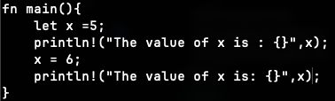

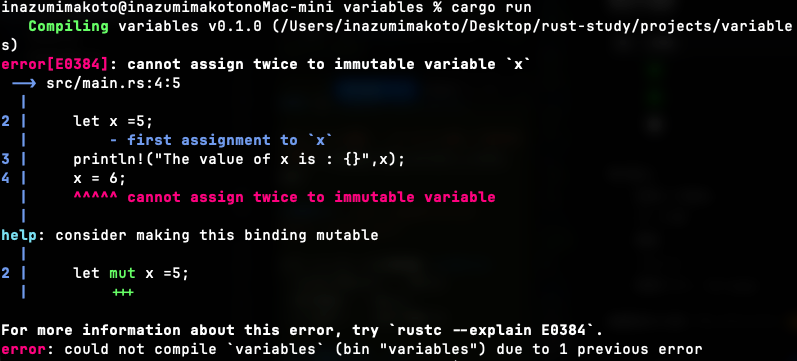

**エラー内容も超親切！**
- どの行が問題か教えてくれる
- `help: consider making this binding mutable` ← 直し方まで提案！

#### ✅ `mut` をつけると...

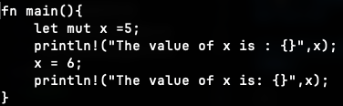

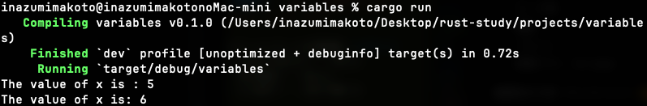

動いた！🎉

### 不変変数 vs 定数

「不変ならそれ定数じゃん」って思ったけど違う！

```rust
const MAX_POINT: u32 = 100_000;  // 定数
let x = get_input();              // 不変変数
```

| 特徴 | `let x = 5;` (不変変数) | `const X: u32 = 5;` (定数) |
|------|------------------------|---------------------------|
| 値の決定 | **実行時**でもOK | **コンパイル時**に確定必須 |
| 型注釈 | 省略可能 | **必須** |
| シャドーイング | ✅ できる | ❌ できない |
| グローバルスコープ | ❌ 使えない | ✅ 使える |

**使い分け**:
- 定数: 設定値、マジックナンバー
- 不変変数: 標準入力、計算結果など実行時に決まる値

### 数値の区切り `100_000`

見やすくていい！Rust固有じゃなく最近の言語は対応してる。

| 言語 | 書き方 |
|------|--------|
| Rust | `100_000` |
| Python 3.6+ | `100_000` |
| Java 7+ | `100_000` |
| C++14+ | `100'000` ← シングルクォートきっしょ |

C++は `'` を使う変態仕様...

---

## シャドーイング

「不変変数なのに値変えられるの？」って思ったけど、これは**新しい変数を作ってる**！

```rust
let x = 5;       // x: i32
let x = x + 1;   // 新しい x を作成（前のxを「覆い隠す」）
```

**上書きじゃなくて「覆い被さる」感じ！**

#### 🔬 実験


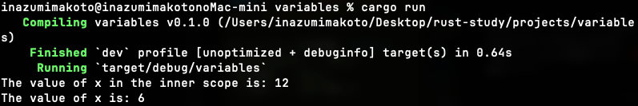

- inner scope: x = 12（6 * 2）
- 外に出たら: x = 6（元に戻った！）

**スコープ抜けたら前の変数が復活する！**

### シャドーイング vs mut

```rust
// シャドーイング：型を変えられる！
let guess = "42";
let guess = guess.parse::<i32>().unwrap();  // String → i32 OK！

// mut：型は変えられない
let mut x = "hello";
x = 5;  // ❌ エラー！
```

**メリット**: `guess_str` と `guess_num` を作る必要がなくなる！

---

## データ型

Rustは**静的型付け言語**！コンパイル時に全ての変数の型がわかってなきゃいけない。

| 静的型付け | 動的型付け |
|-----------|-----------|
| Rust, C++, Java, Go | Python, JavaScript, Ruby, PHP |

### parse()は型を明示！

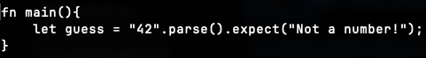

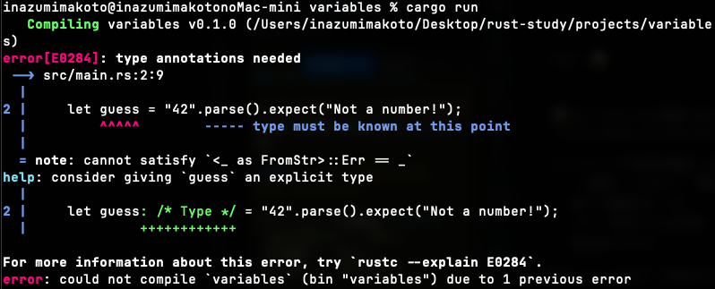

`parse()` は何にパースするか教えてあげないとダメ！

```rust
let guess: i32 = "42".parse().unwrap();  // i32に
let guess: f64 = "3.14".parse().unwrap(); // f64に
```

### 整数型

| 符号あり | 符号なし | ビット数 |
|---------|---------|---------|
| `i8` | `u8` | 8 |
| `i16` | `u16` | 16 |
| `i32` | `u32` | 32 |
| `i64` | `u64` | 64 |
| `i128` | `u128` | 128 |
| `isize` | `usize` | アーキテクチャ依存 |

- `i` = 符号あり（正負）
- `u` = 符号なし（正のみ）
- `usize` = 配列のインデックス用（C++の`size_t`的な）
- **基本は `i32` でOK！**

### 数値リテラル

| 記法 | 意味 |
|------|------|
| `100_000` | 10万（見やすい！） |
| `0xff` | 16進数 |
| `0o77` | 8進数 |
| `0b1111` | 2進数 |
| `b'A'` | バイト（u8） |

### 浮動小数点数

- `f32` - 単精度
- `f64` - 倍精度（**基本これでOK！**）

### bool型

`true` / `false`。普通。

### char型（Rustすごい！）

```rust
let c = '🦀';  // 絵文字もOK！
```

| 言語 | char | Unicode |
|------|------|---------|
| **Rust** | **4バイト** | ✅ 完全対応 |
| C/C++ | 1バイト | ❌ ASCIIのみ🤮 |
| Java | 2バイト | △ 絵文字は2つ必要 |

C++は `char` が1バイトとかいう時代遅れ...wchar_t使えとか言うなよ...

### タプル

```rust
let tup: (i32, f64, u8) = (500, 6.4, 1);
let (x, y, z) = tup;  // パターンマッチで取り出す
let first = tup.0;    // 添字でもOK
```

### 配列

```rust
let a = [1, 2, 3, 4, 5];       // 型推論
let a: [i32; 5] = [1, 2, 3, 4, 5];  // 型と個数明示
let a = [3; 5];  // 3が5個！[3, 3, 3, 3, 3]
```

**配列はサイズ固定！** なぜ？ → **スタックに置くから！超高速！**

| | 配列 | Vec |
|---|------|-----|
| 場所 | スタック | ヒープ |
| サイズ | 固定 | 可変 |
| 速度 | 超高速 | 普通 |

C++の `std::array` vs `std::vector` と同じ！

#### `[3; 5]` の書き方 - 言語比較

| 言語 | 「3を5個」 |
|------|-----------|
| **Rust** | `[3; 5]` ← 簡潔！ |
| Python | `[3] * 5` |
| JavaScript | `Array(5).fill(3)` |
| C++ | ループ or `std::fill`🤮 |

迷ったら `Vec` を使え！月みたいに固定なら配列！

### 🔬 実行時の範囲外チェック（Rustの真価！）

標準入力からインデックスを受け取って配列にアクセスするプログラム：

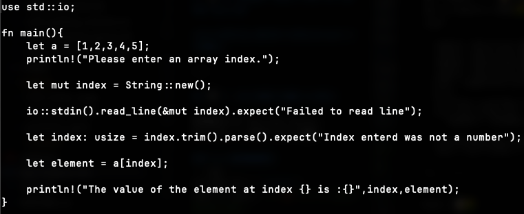

10を入力すると...（配列は5要素）


#### 🙏 神のお告げ（エラーメッセージ日本語訳）

```
thread 'main' panicked at src/main.rs:13:19:
index out of bounds: the len is 5 but the index is 10
```

**訳**: 
> 「メインスレッドがsrc/main.rsの13行目19列目でパニックしました：
> インデックスが範囲外です。長さは5なのにインデックスは10です」

**神情報！**
- ✅ ファイル名
- ✅ 行番号・列番号
- ✅ 配列の長さ
- ✅ 入力されたインデックス

#### C++だと...

```
Segmentation fault
```
または
```
-1823471234  // 意味不明なゴミ値
```

**情報量ゼロ！原因不明！**

| | Rust | C++ |
|---|------|-----|
| コンパイル | 通る | 通る |
| 範囲外時 | **パニック＋詳細エラー** | 未定義動作💀 |
| デバッグ | 一瞬で原因特定 | 3日徹夜 |

---

## 関数

`fn` で定義！命名規則は**スネークケース**（全部小文字、単語はアンダースコア区切り）

```rust
fn another_function() {
    println!("Another function.");
}
```

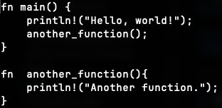

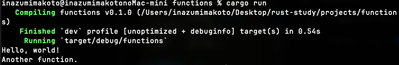

### 引数（パラメータ）

```rust
fn another_function(x: i32) {  // x: i32 = 仮引数 (parameter)
    println!("The value of x is: {}", x);
}

another_function(5);  // 5 = 実引数 (argument)
```

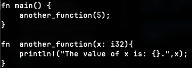

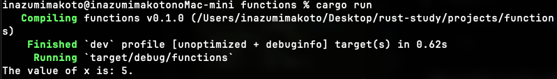

| 用語 | 英語 | 場所 |
|------|------|------|
| 仮引数 | parameter | 関数定義 |
| 実引数 | argument | 関数呼び出し |

### なぜ引数の型指定が必須？

**Rustの設計思想: 明示的 > 暗黙的**

| 理由 | 説明 |
|------|------|
| 自己文書化 | 関数シグネチャを見ただけで使い方がわかる |
| エラーの早期発見 | 型ミスがすぐわかる |
| コンパイル高速化 | 呼び出し元を見なくていい |
| APIの契約 | 「この関数はi32を受け取る」が明確 |

### `x = y = 6` ができない理由

**C/C++がキモいだけ！**

```c
// C/C++: 代入は「式」で値を返す
int x, y;
x = y = 6;  // y = 6 が 6 を返し、x = 6 になる

// これがバグの温床！
if (x = 5) {  // 比較じゃなくて代入！コンパイル通る！💀
    // 常にtrue...
}
```

```rust
// Rust: 代入は「文」で () を返す
// if x = 5 {}  // ❌ コンパイルエラー！boolじゃないよ！
```

| | C/C++ | Rust |
|---|-------|------|
| 代入 | 式（値を返す） | 文（()を返す） |
| `if (x = 5)` | 通る（バグ）💀 | エラー！✅ |

**Rustはバグを生みやすい構文を排除してる！**

### 文 (Statement) vs 式 (Expression)

**Rustは式ベースの言語！**

| | 文 (Statement) | 式 (Expression) |
|---|----------------|-----------------|
| 値を返す | ❌ 返さない | ✅ 返す |
| セミコロン | あり | なし |

#### ブロックは式！

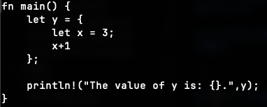

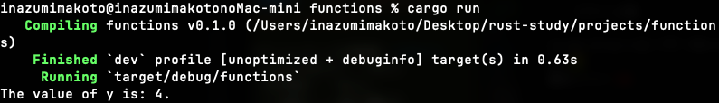

```rust
let y = {
    let x = 3;  // 文（セミコロンあり）
    x + 1       // 式！→ ブロックの戻り値
};  // y = 4
```

#### 関数の戻り値

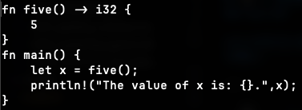

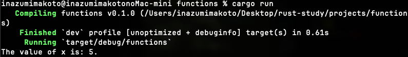

```rust
fn five() -> i32 {
    5  // セミコロンなし！→ 戻り値
}
```

**`return` は早期リターン用！** 通常は最後の式がそのまま戻り値。

#### セミコロンつけると？

```rust
fn five() -> i32 {
    5;  // セミコロンつけると () を返す → 型エラー！
}
```

### 式ベースのメリット（C++との比較）

```rust
// Rust: if は式！値を返せる！
let x = if condition { 5 } else { 10 };
```

```cpp
// C++: if は文。値を返せない...冗長
int x;
if (condition) { x = 5; } else { x = 10; }
```

| | Rust（式ベース） | C++（文ベース） |
|---|-----------------|-----------------|
| if | 値を返せる ✅ | 返せない 🤮 |
| match/switch | 値を返せる ✅ | 返せない 🤮 |
| ブロック | 値を返せる ✅ | 返せない 🤮 |
| コード | 簡潔 | 冗長 |

---

## 制御フロー

### if文

```rust
if number < 5 {
    println!("true");
} else {
    println!("false");
}
```

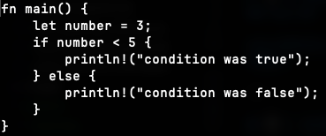

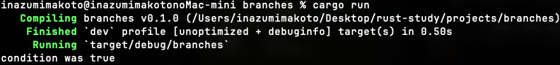

#### C++との違い

| ポイント | Rust | C/C++ |
|---------|------|-------|
| 条件式の() | 不要 | 必須 |
| 条件式の型 | **bool必須**✅ | 0/非0でOK（危険）🤮 |
| ifは式？ | ✅ 式！ | ❌ 文 |

```cpp
// C++: 0以外はtrue扱い...危険すぎ
if (5) { }        // 常にtrue 💀
if (ptr) { }      // nullptrチェック...読みにくい
```

```rust
// Rust: boolじゃないとエラー！安全！
if 5 { }  // ❌ コンパイルエラー！
```

#### ifは式！

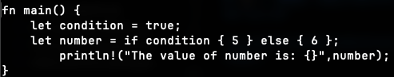

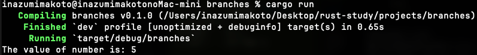

```rust
let number = if condition { 5 } else { 6 };
```

**注意**: if と else の戻り値の型は同じじゃないとダメ！

#### else if 多すぎ → match使え！

```rust
// これはきたない...
if x == 1 { } else if x == 2 { } else if x == 3 { } // ...

// matchを使おう！（第6章）
match x {
    1 => {},
    2 => {},
    3 => {},
    _ => {},
}
```

### ループ

Rustは**3つだけ**！シンプル！

| 構文 | 用途 |
|------|------|
| `loop` | 無限ループ |
| `while` | 条件ループ |
| `for` | イテレータループ |

#### loop（無限ループ）

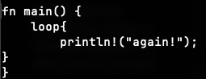

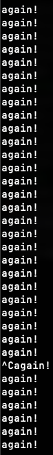

```rust
loop {
    println!("again!");
}
// ^C で止める
```

`break` で抜ける、`continue` で次へ。ラベルで特定のループを抜けれる！

#### for（イテレータ）

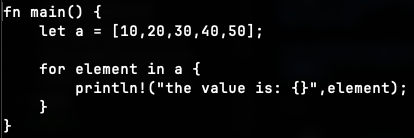

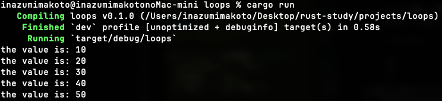

```rust
let a = [10, 20, 30, 40, 50];
for element in a {
    println!("{}", element);
}

// Range
for i in 1..4 {  // 1, 2, 3
    println!("{}", i);
}
```

#### C++のループ構文多すぎ問題🤮

| 構文 | C++ | Rust |
|------|-----|------|
| 伝統的for | `for(i=0;i<n;i++)` | ❌ なし |
| Range-based | `for(auto x : v)` | `for x in v` |
| while | `while(cond)` | `while cond` |
| do-while | `do {} while(cond)` | ❌ **なし！** |
| 無限ループ1 | `while(true)` | `loop` |
| 無限ループ2 | `for(;;)` | ← なにこれきも。泣いてるみたいだね。バグいっぱいあって泣きたいのはこっちだよ😭 |

**C++は書き方多すぎて混乱の元！**

#### なぜ `for(i=0;i<n;i++)` を使わない？

```cpp
// C++: バグの温床
for (int i = 0; i <= n; i++) {  // <= か < か間違える
    arr[i];  // 範囲外アクセス💀
}
```

```rust
// Rust: 安全で明確
for i in 0..n { }        // Range明確
for element in &arr { }  // インデックス不要！範囲外アクセス不可能！
```

#### `for x in a` vs `for x in &a`（所有権！）

```rust
// in a → 所有権を奪う（消費！）
for element in vec {
    println!("{}", element);
}
// vec はもう使えない！Moveされた！

// in &a → 借用
for element in &vec {
    println!("{}", element);  // &T
}
// vec はまだ使える！
```

| 書き方 | 意味 | ループ後 |
|--------|------|----------|
| `for x in a` | 所有権Move | 使えない |
| `for x in &a` | 借用 | 使える |
| `for x in &mut a` | 可変借用 | 変更可能 |

**所有権・借用の詳細は第4章で！** → [ch04_ownership.md](ch04_ownership.md)

#### イテレータは超強力！

```rust
// チェーン可能（関数型っぽい）
let result: Vec<i32> = v.iter()
    .map(|x| x * 2)      // 2倍
    .filter(|x| *x > 4)  // フィルタ
    .collect();          // 収集
```

```cpp
// C++でこれやると...
std::vector<int> result;
for (auto x : v) {
    int doubled = x * 2;
    if (doubled > 4) {
        result.push_back(doubled);
    }
}
// 冗長！🤮
```

#### ポインタ/イテレータの安全性

| | C++ | Rust |
|---|-----|------|
| 生ポインタ | 使える（危険💀） | `unsafe` 必須 |
| 参照 | 寿命管理なし | 所有権で管理 |
| null | あり（NullPointerException！）| **なし**（`Option<T>`） |
| イテレータ無効化 | 起きる💀 | 所有権で防止 |

---

## 💡 学んだこと

- Rustはデフォルト不変（C++と逆！安全！）
- `mut` で可変にする
- `const` は**コンパイル時**に値が決まる必要がある
- `let` は**実行時**に値が決まってもOK
- `100_000` で数値を読みやすく書ける
- シャドーイングは**新しい変数を作る**（上書きじゃない）
- シャドーイングなら**型も変えられる**（mutでは無理）
- Rustは**静的型付け**言語
- `parse()` は型を明示する必要あり
- 基本は `i32` と `f64`
- `char` は4バイトでUnicode完全対応（C++は1バイト🤮）
- 配列は固定サイズ（スタック）、Vecは可変（ヒープ）
- 関数は `fn` で定義、スネークケース
- 引数の型指定は必須（明示的 > 暗黙的）
- 代入は文（C++の `if(x=5)` バグを防止）
- Rustは**式ベース**の言語
- ブロック `{}` の最後の式が戻り値になる
- 関数も最後の式が戻り値（`return` は早期リターン用）
- セミコロンつけると式→文になる（`()` を返す）
- if文の条件は**bool必須**（C++は0/非0で危険）
- if文も式として使える（`let x = if ... { } else { };`）
- else if多すぎ → matchを使え！
- ループは3つだけ（`loop`, `while`, `for`）シンプル！
- C++の `for(i=0;i<n;i++)` は使わない（イテレータ推奨）
- do-whileはない（`loop` + `break`で代用）
- イテレータはチェーン可能で超強力！


