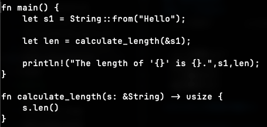
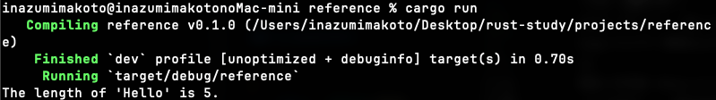
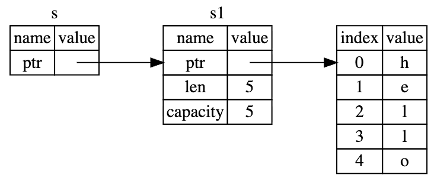
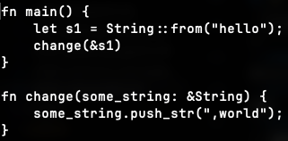

# 第4章: 所有権を理解する

Rustの**最もユニークで重要な機能**！

## なぜ所有権が必要？

メモリ管理の歴史的な問題を解決するため！

### 従来の方法とそのデメリット

#### 方法1: 手動メモリ管理（C/C++）

```cpp
int* ptr = new int(42);  // 確保
// ...使用...
delete ptr;              // 解放
```

| デメリット | 説明 |
|-----------|------|
| メモリリーク💀 | `delete` 忘れ → メモリ食い尽くす |
| ダングリングポインタ💀 | 解放後にアクセス → クラッシュ or 未定義動作 |
| 二重解放💀 | 同じメモリを2回 `delete` → クラッシュ |
| 複雑💀 | どこで誰が解放するか追跡が地獄 |

**結論: C++は人間にメモリ管理を任せる → 人間はミスる → バグ祭り🤮**

---

#### 方法2: ガベージコレクション（Java, Python, Go等）

```java
Object obj = new Object();  // 確保
// ...使用...
// 解放は自動（GCに任せる）
```

| デメリット | 説明 |
|-----------|------|
| 実行時オーバーヘッド💀 | GCが動く度に処理が止まる（Stop the World） |
| 予測不能💀 | いつGCが走るかわからない |
| メモリ使用量増💀 | 解放が遅延するので使用量が増える |
| リアルタイム不向き💀 | ゲーム、組み込み系では致命的 |

**結論: 安全だけど遅い。パフォーマンスが犠牲になる。**

---

### 方法3: 所有権（Rust）🦀

**天才的アイデア！全く新しい第三の方法！**

```rust
let s = String::from("hello");  // 確保
// ...使用...
// スコープを抜けると自動で解放！
```

| 特徴 | 説明 |
|------|------|
| コンパイル時チェック✅ | 実行前にメモリ問題を検出 |
| ゼロコスト✅ | 実行時のオーバーヘッドなし！ |
| 予測可能✅ | いつ解放されるか明確 |
| 安全✅ | ダングリングポインタ不可能 |

**コンパイラがチェックするから実行が遅くなることはない！**

---

## 比較まとめ

| 方法 | 安全性 | パフォーマンス | 開発体験 |
|------|--------|---------------|----------|
| 手動（C++）| ❌ 危険 | ✅ 速い | ❌ 地獄 |
| GC（Java等）| ✅ 安全 | ❌ 遅い | ✅ 楽 |
| **所有権（Rust）** | **✅ 安全** | **✅ 速い** | 🤔 学習曲線 |

**Rustは「安全」と「速い」を両立した革命的な言語！**

C++とかいうゴミ言語とは大違い。

---

## スタックとヒープ

基本的にスタックとヒープがある。これはC++も同じだしコンピュータはそう。

| | スタック | ヒープ |
|---|---------|--------|
| 速度 | 超速い | 遅い |
| サイズ | 固定 | 可変 |
| 管理 | 自動 | **手動/GC/所有権** |

### ヒープの厄介さ

ヒープは**ポインタで行ったり来たり**しなきゃいけないのが厄介。

```
スタック          ヒープ
┌─────────┐      ┌─────────────────┐
│ ptr ────┼─────→│ "hello world"   │
└─────────┘      └─────────────────┘
  どこにある？       ここにある
```

- どこで確保した？
- 誰が使ってる？
- いつ解放する？
- 誰が解放する？

**C++だとこの管理が地獄！**

**これも所有権が解決してくれる。**

> **この世の問題は全て所有権が解決してくれる**

---

## 🔥 所有権の3つのルール（超重要！）

**肝に銘じろ！**

| # | ルール | わかりやすく言うと |
|---|--------|-------------------|
| 1 | 各値には「所有者」と呼ばれる変数がある | **全ての値には持ち主がいる** |
| 2 | 所有者は常に1人だけ | **1つの値に2人の持ち主は存在しない** |
| 3 | 所有者がスコープを抜けたら値は破棄 | **持ち主がいなくなったら値も消える** |

### もっとわかりやすく

```rust
{
    let s = String::from("hello");  // s が "hello" の所有者
    // ここで s は有効
}   // ← スコープ終わり。s がいなくなる。"hello" も消える！
```

### 所有者は1人だけ！

```rust
let s1 = String::from("hello");
let s2 = s1;  // 所有権が s1 から s2 に移動（Move）

// println!("{}", s1);  // ❌ エラー！s1 はもう所有者じゃない！
println!("{}", s2);     // ✅ s2 が所有者！
```

**C++だったら両方使えてダングリングポインタの地獄💀**

---

## String型とメモリ

### 文字列リテラル vs String

```rust
let s1 = "hello";              // 文字列リテラル（バイナリにハードコード）
let s2 = String::from("hello"); // String型（ヒープに確保）
```

| | 文字列リテラル | String |
|---|---------------|--------|
| 保存場所 | バイナリ | ヒープ |
| サイズ | コンパイル時に決定 | 実行時に可変 |
| 可変性 | 不変 | 可変可能 |

### Stringのメモリ構造


スタックに `ptr`, `len`, `capacity`。ヒープに実際のデータ。

---

## Move（ムーブ）

```rust
let s1 = String::from("hello");
let s2 = s1;  // s1 → s2 にムーブ！
```


**s1 と s2 が同じヒープを指すと、スコープ抜ける時に二重解放！**

→ だから Rust は **s1 を無効化** する！

```rust
let s1 = String::from("hello");
let s2 = s1;

// println!("{}", s1);  // ❌ エラー！s1 はもう使えない！
println!("{}", s2);     // ✅ OK
```

---

## Clone（クローン）= ガチコピー

ヒープのデータも含めて完全コピーしたい場合：

```rust
let s1 = String::from("hello");
let s2 = s1.clone();  // ガチコピー！

println!("{}", s1);  // ✅ OK
println!("{}", s2);  // ✅ OK
```


**注意**: `clone()` は高コスト（ヒープにメモリ確保するから）

---

## Copy トレイト（スタックだけの型）

```rust
let x = 5;
let y = x;  // x も y も使える！矛盾してない？

println!("{}", x);  // ✅ OK
println!("{}", y);  // ✅ OK
```

**なぜ？** → 整数は `Copy` トレイトを持つ！

### Copy な型

| 型 | 説明 |
|----|------|
| `i32`, `u32`, 全整数型 | ✅ Copy |
| `f32`, `f64` | ✅ Copy |
| `bool` | ✅ Copy |
| `char` | ✅ Copy |
| `(i32, i32)` | ✅ Copy（中身が全部Copyなタプル）|
| `(i32, String)` | ❌ Move（Stringが入ってるから）|

**スタックだけの型はコピーが安いから Copy！**

---

## 関数と所有権

### 所有権を渡す（Move）

```rust
fn main() {
    let s = String::from("hello");
    takes_ownership(s);         // s がムーブされる！
    
    // println!("{}", s);       // ❌ もう使えない！
}

fn takes_ownership(some_string: String) {
    println!("{}", some_string);
}   // some_string がドロップされてメモリ解放
```

### Copyな型は大丈夫

```rust
fn main() {
    let x = 5;
    makes_copy(x);              // コピーされる
    
    println!("{}", x);          // ✅ まだ使える！
}

fn makes_copy(some_integer: i32) {
    println!("{}", some_integer);
}
```

### 図解

```
String を渡す:
main             takes_ownership
┌─────┐          ┌─────────────┐
│  s  │ ──Move──→│ some_string │
└─────┘          └─────────────┘
  ↓                    ↓
使えない！           使える→解放

i32 を渡す:
main             makes_copy
┌───┐            ┌──────────────┐
│ x │ ──Copy──→  │ some_integer │
└───┘            └──────────────┘
  ↓                    ↓
使える！            使える→終わり
```

---

## 「不便すぎ！」→ 借用で解決！

```rust
takes_ownership(s);  // 渡したら使えなくなる！不便！
```

---

## 参照と借用（Borrowing）

**所有権を渡さずに値を使う方法！**

### 参照を渡す





```rust
fn main() {
    let s1 = String::from("Hello");
    let len = calculate_length(&s1);  // &s1 で参照を渡す！
    println!("The length of '{}' is {}.", s1, len);  // s1 まだ使える！
}

fn calculate_length(s: &String) -> usize {  // &String で受け取る
    s.len()
}
```

### メモリの図



`s` は `s1` を指すだけ。所有権は `s1` のまま！

---

## 🔥 Rust vs C++: 参照の書き方

### Rust: 両方に `&` がある！明示的！

```rust
calculate_length(&s1);              // 渡す側: & あり！

fn calculate_length(s: &String) {}  // 受ける側: & あり！
```

### C++: 渡す側に何もない...闇

```cpp
calculate_length(s1);               // 渡す側: & なし...

int calculate_length(string& s) {}  // 受ける側だけ & あり
```

| | Rust | C++ |
|---|------|-----|
| 渡す側 | `&s1` **明示的！** | `s1` わからない |
| 受ける側 | `&String` | `string&` |
| 呼び出しを見て判断 | ✅ 一目瞭然 | ❌ 定義見ないと不明 |

### C++の闇

```cpp
foo(x);  // これ何？
         // - 参照渡し？
         // - コピー？
         // - ムーブ？
         // 関数定義見ないとわからない💀
```

### Rustの光

```rust
foo(x);      // ムーブ
foo(&x);     // 不変借用
foo(&mut x); // 可変借用
// 呼び出し側だけで全部わかる！✅
```

**Rustは呼び出し側を見るだけで所有権の動きがわかる！**

---

## 可変参照（Mutable Reference）

### 不変参照では変更できない！




```rust
fn change(some_string: &String) {  // 不変参照
    some_string.push_str(",world");  // ❌ エラー！
}
```

### `&mut` で解決！

```rust
fn main() {
    let mut s = String::from("hello");  // mut 必要！
    change(&mut s);                      // &mut で渡す
}

fn change(some_string: &mut String) {   // &mut で受け取る
    some_string.push_str(",world");      // ✅ OK！
}
```

### `&` vs `&mut` は「権限」の違い！

```
&String     = 読み取り専用の鍵 🔒
&mut String = 読み書きできる鍵 🔓
```

**同じ場所を指すけど、できることが違う！**

---

## 自動デリファレンス（Rustの便利機能）

### C++ は `.` と `->` を使い分ける

```cpp
String s = "hello";
String* ptr = &s;

s.length();      // 値なら .
ptr->length();   // ポインタなら ->
(*ptr).length(); // これと同じ
```

### Rust は `.` だけ！

```rust
let s = String::from("hello");
let r = &s;      // 参照
let rr = &&s;    // 参照の参照

s.len();   // ✅
r.len();   // ✅ 自動で辿る！
rr.len();  // ✅ 何段でも自動！
```

**Rust は参照を自動的に外してくれる！`->` 不要！**

| | C++ | Rust |
|---|-----|------|
| 値のメソッド | `s.method()` | `s.method()` |
| ポインタ/参照 | `ptr->method()` | `r.method()` |
| 覚えること | 2種類 | **1種類！** |

**「これポインタだっけ？値だっけ？」を考えなくていい！**

---

## 借用のルール

### ルール1: 可変参照は1つだけ！

```rust
let mut s = String::from("hello");
let r1 = &mut s;
let r2 = &mut s;  // ❌ エラー！
```

**理由**: データ競合を防ぐ！

### ルール2: 不変借用中は可変借用できない！

```rust
let mut s = String::from("hello");
let r1 = &s;      // 不変借用
let r2 = &s;      // OK
let r3 = &mut s;  // ❌ エラー！読んでる人いるのに変えるな！
```

### なぜこのルールが必要？

**イテレータ無効化を防ぐため！**

### 🔬 C++で実験（実験済み！）

```cpp
vector<int> v = {1, 2, 3};
int& first = v[0];  // 参照を取得

for (int i = 0; i < 100; i++) {
    v.push_back(i);  // 再配置が起きる！
}

cout << first;  // 💀 ダングリング参照！
```

### 実験結果

```
Before:
first のアドレス = 0x104439aa0

After (push_back 100回後):
v[0] のアドレス = 0x10443b0b0  ← 変わった！

first (ダングリング!) = 4  ← ゴミ値！
💀 アドレスが変わった！first はゴミを指してる！
```

**C++は何も言わずにゴミ値を返す！**

### Rustだと？

```rust
let mut v = vec![1, 2, 3];
let first = &v[0];
v.push(4);        // ❌ コンパイルエラー！
println!("{}", first);
```

```
error[E0502]: cannot borrow `v` as mutable because it is also borrowed as immutable
```

**Rustは「借用中にプッシュするな！」ってコンパイル時に止める！**

### 借用ルールまとめ

| ルール | 理由 |
|--------|------|
| `&mut` は1つだけ | データ競合防止 |
| `&` と `&mut` は共存不可 | イテレータ無効化防止 |
| `&` は複数OK | 読むだけなら安全 |

---

## 💡 学んだこと

- メモリ管理には3つの方法がある
- 手動管理は危険すぎる（C++🤮）
- GCは安全だけど遅い
- Rustの所有権は**コンパイル時チェック**で両方の問題を解決！
- 文字列リテラルはバイナリ、Stringはヒープ
- **Move**: 所有権が移動して元の変数は使えなくなる
- **Clone**: ガチコピー（ヒープも含めて複製）
- **Copy**: スタックだけの型は自動コピー（整数、bool等）
- 関数に渡すとMoveされる（Copyな型は除く）
- **参照と借用**: `&` で所有権を渡さずに値を使える！
- Rustは渡す側にも `&` があって一目でわかる（C++は闇）
- **可変参照**: `&mut` で参照先を変更できる（権限の違い！）
- **自動デリファレンス**: `.` だけでOK（C++の `->` 不要！）
- **借用ルール**: `&mut` は1つだけ、`&` と `&mut` は共存不可
- イテレータ無効化をコンパイル時に防ぐ（C++は実行時に💀）
