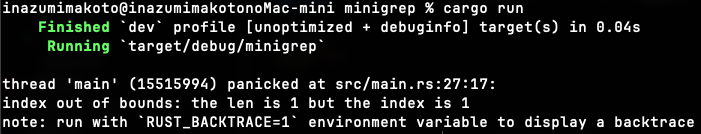

# 第12章: コマンドラインプログラムの構築 (`minigrep`)

## 1. プロジェクトのセットアップと基本実装

### 実装したコード (`src/main.rs`)

```rust
use std::env;
use std::fs::File;
use std::io::prelude::*;

fn main() {
    // 1. コマンドライン引数の取得
    let args: Vec<String> = env::args().collect();

    // 2. 引数の保存（参照を使用）
    let query = &args[1];
    let filename = &args[2];

    println!("Searching for {}", query);
    println!("In file {}", filename);

    // 3. ファイルを開く
    let mut f = File::open(filename).expect("file not found");

    // 4. ファイルの中身を読み込む
    let mut contents = String::new();
    f.read_to_string(&mut contents).expect("something went wrong reading the file");

    println!("With text:\n{}", contents);
}
```

## 💡 学んだこと・解説

### `use` と `#include`
*   `use` は Rust の名前空間を持ち込む機能。C++ の `using namespace` に近い。
*   `std::io::prelude::*` は I/O 処理に必要なトレイト（`Read`, `Write` など）を一括でインポートするために使う。これがないと `read_to_string` が使えない。

### コマンドライン引数 (`env::args()`)
*   `env::args()` はイテレータを返す。
*   `.collect()` でイテレータを消費して、ベクタ (`Vec<String>`) に変換する。
*   Python の `sys.argv` に近いが、Rust では明示的にコレクションに変換する必要がある。

### ファイル操作 (`File::open`)
*   **`File`**: 構造体名なので CamelCase（大文字始まり）。
*   **`mut f`**: `read_to_string` はファイルカーソルを進めるため、**ファイルオブジェクトの内部状態を変更する**。そのため、読み込みだけでも `mut` が必要。ここが重要！
*   **Rust の安全性**: ファイルが開けなかったり読み込めなかった場合は `expect` でパニックさせ、エラーを見逃さないようにしている。

### 所有権と参照
*   `query` や `filename` は `args` のデータを借用（参照 `&`）している。
*   データをコピー（`clone`）したり移動（`move`）させたりせず、参照を使うのがメモリ効率が良いベストプラクティス。

---

## 2. リファクタリング: 引数解析の抽出

`main` 関数が大きくなってきたので、引数解析のロジックを別の関数 `parse_config` に切り出す。

### 実装 (`src/main.rs`)

```rust
fn main() {
    let args: Vec<String> = env::args().collect();

    let (query, filename) = parse_config(&args);

    // ...
}

fn parse_config(args: &[String]) -> (&str, &str) {
    let query = &args[1];
    let filename = &args[2];

    (query, filename)
}
```

### 💡 なぜ `args: &[String]` なの？

`args` は `Vec<String>` なのに、なぜ関数の引数は `&[String]` （文字列スライス）にするのか？

#### 比較

| 書き方 | 意味 | メリット・デメリット |
|--------|------|----------------------|
| `args: Vec<String>` | 所有権をもらう | 元の場所で `args` が使えなくなる（move）。 |
| `args: &Vec<String>` | `Vec` の参照をもらう | `Vec` しか受け取れない。 |
| **`args: &[String]`** | **スライスをもらう** | **最も柔軟！** `Vec` 全体も、配列も、その一部も受け取れる。 |

#### ポイント
*   Rust では、コレクションへの参照を引数にする場合、**スライス (`&[T]`) を使うのが慣習（Idiom）**。
*   `&args` と書くだけで、Rust コンパイラが自動的に `&Vec<String>` を `&[String]` に変換してくれる（**Deref Coercion**）。
*   これにより、関数は「データの入れ物が何であれ、連続したデータの並びであれば何でもOK」という広い心を持つことができる。

---

#### ⚠️ 混乱ポイント: `&str` と `&[T]` は別物！

「スライス」という言葉には2種類あるので注意！

1.  **文字列スライス (`&str`)**
    *   **中身**: 文字列データ（UTF-8 bytes）の一部を指す。
    *   **例**: `"Hello"` のうち `"He"` だけを切り出す。
    *   **型**: `&str`

2.  **ベクタのスライス (`&[T]`)**
    *   **中身**: ベクタの**要素**の一部を指す。
    *   **例**: `["aaa", "bbb", "ccc"]` のうち `["aaa", "bbb"]` だけを切り出す。
    *   **型**: `&[String]` （もし中身が `i32` なら `&[i32]`）

今回 `parse_config(args: &[String])` で使っているのは **2. ベクタのスライス**。
`args` 変数（`Vec<String>`）は「文字列という箱」が並んだ棚みたいなもので、その「棚の一部（または全部）」を指し示しているのが `&[String]`。文字列の中身を切り刻んでいるわけではない！

---

## 3. リファクタリング: 構造体 `Config` の導入

引数の意味を明確にするため、タプルではなく専用の構造体 `Config` を使う。

### 実装 (`src/main.rs`)

```rust
struct Config {
    query: String,
    filename: String,
}

fn parse_config(args: &[String]) -> Config {
    // args は借用しているので、所有権を奪うことはできない。
    // Config はデータを所有したい (String) なので、データをコピー (clone) する必要がある。
    let query = args[1].clone();
    let filename = args[2].clone();

    Config { query, filename }
}

fn main() {
    let args: Vec<String> = env::args().collect();
    let config = parse_config(&args); // 呼び出し側もスッキリ！
    
    // ...
}
```

### 💡 なぜ `clone()` が必要なの？

**所有権の問題を回避するため！**

1.  **`Config` の定義**: `query: String` となっている。これは `Config` がデータの **所有権** を持ちたいということ。
2.  **`args` の状態**: `parse_config` は `&[String]` (参照) を受け取っている。つまり、データの所有者は `main` 関数の `args` 変数。
3.  **移動 (Move) 不可**: 借りているもの (`&args`) から、中身 (`String`) を勝手に持ち出して、自分のもの (`Config`) にすることはできない（所有権の移動禁止）。

#### 解決策
*   **A案: `clone()` する** (今回採用)
    *   データをまるっとコピーして新しい `String` を作る。
    *   **メリット**: 実装が単純、所有権の問題が消える。
    *   **デメリット**: メモリと時間を少し余分に使う（今回の規模なら無視できる）。
*   **B案: ライフタイムを使う** (今の段階では難しい)
    *   `struct Config<'a> { query: &'a str, ... }` のように参照を持つ。
    *   **メリット**: コピーしないので高速。
    *   **デメリット**: ライフタイム指定が必要になり、コードが複雑になる。

今回は**シンプルさ優先**で `clone()` を採用している。Rust 初学者はまず `clone` で動くものを作り、後で必要なら最適化するのが良い戦略！

---

## 4. リファクタリング: コンストラクタ `Config::new`

`parse_config` という関数名は少し独特。多くの言語では、インスタンスを作成する役割は「コンストラクタ」が担う。
Rust には `new` という特別なキーワードはないが、慣習として `new` という名前の **関連関数** を定義する。

### 実装 (`src/main.rs`)

```rust
impl Config {
    fn new(args: &[String]) -> Config {
        let query = args[1].clone();
        let filename = args[2].clone();

        Config { query, filename }
    }
}

fn main() {
    let args: Vec<String> = env::args().collect();
    let config = Config::new(&args); // 構造体に関連付いた関数呼び出しになる
    // ...
}
```

### 💡 C++ のメンバ関数と同じ？

かなり近いけど、厳密には **「静的メンバ関数 (static member function)」** にあたるよ！

| Rust の用語 | 定義の見た目 | 呼び出し方 | C++ でいうと |
|-------------|--------------|------------|--------------|
| **関連関数** (Associated Function) | `fn new(args: ...)` <br> (`self` を取らない) | `Config::new(...)` | **static メンバ関数** <br> `Config::new(...)` |
| **メソッド** (Method) | `fn check(self)` <br> (`self` を取る) | `config.check()` | **メンバ関数** <br> `config.check()` |

`Config::new` はインスタンス (`self`) なしで呼び出せるから、C++ の `static` 関数と同じ扱い。
### 悪い例: 引数が足りないとパニック！

ここまでは引数の数をチェックしていなかったので、引数なしで実行すると配列外アクセスで強制終了（パニック）していた。



```bash
index out of bounds: the len is 1 but the index is 1
```

---

## 5. リファクタリング: エラー処理の改善

パニックは「バグ」の時に使うべきで、ユーザーの使い方が間違っている時は「親切なエラーメッセージ」を出して終了するのが良いプログラム。

### 実装の変更点 (`src/main.rs`)

```rust
use std::process; // プロセスを終了させるために必要

fn main() {
    // unwrap_or_else: 成功したら値を、失敗したら {} 内を実行！
    let config = Config::new(&args).unwrap_or_else(|err| {
        println!("Problem parsing arguments: {}", err);
        process::exit(1); // 異常終了コード 1 で終わる
    });
    // ...
}

// 戻り値を Result 型に変更
// 成功時: Config, 失敗時: &'static str (静的文字列スライス)
impl Config {
    fn new(args: &[String]) -> Result<Config, &'static str> {
        if args.len() < 3 {
            return Err("not enough arguments");
        }
        // ... (省略)
        Ok(Config { query, filename })
    }
}
```

### 💡 徹底解説: これは何？？

#### 1. `Result<Config, &'static str>`
*   **`Result<Okの型, Errの型>`**: 処理が成功するか失敗するかわからない時に使う型。
*   **`&'static str`**: 「プログラムが動いている間ずっとメモリにある文字列」のこと。
    *   `"not enough arguments"` のようなハードコードされた文字列リテラルは、コンパイル時にバイナリに含まれるので、寿命は「永遠 (`'static`)」。
    *   つまり、「エラーメッセージ（固定の文字列）を返すよ」という意味。

#### 2. `unwrap` vs `unwrap_or_else`
*   **`unwrap()`**:
    *   成功 (`Ok`) → 中身を取り出す。
    *   失敗 (`Err`) → **問答無用でパニック（強制終了）**。
*   **`unwrap_or_else(...)`**:
    *   成功 (`Ok`) → 中身を取り出す。
    *   失敗 (`Err`) → **パニックせずに、指定された関数（クロージャ）を実行する**。

#### 3. `|err| { ... }` (クロージャ)
*   **クロージャ (Closure)**: 名前をつけずにその場で作れる「匿名関数」。
*   **ラムダ式**: C++ や Python, Java で言う「ラムダ式」とほぼ同じもの！
*   `|引数| { 中身 }` という独特な構文。 (`|` は数学の絶対値記号ではなくパイプ)
*   今回は「失敗した時のエラーメッセージ (`err`) を受け取って、それを表示して終了する」という処理を `unwrap_or_else` に渡している。

```rust
// イメージ
fn anonymous_function(err: &'static str) {
    println!("Problem parsing arguments: {}", err);
    process::exit(1);
}
```
これと同じことを `|err| { ... }` で短く書いているだけ！🦀

---

## 6. リファクタリング: ロジックの分離 (`run` 関数)

`main` 関数は「設定の解析」と「エラー処理」に集中させ、実際のファイル読み出しなどのロジックは `run` 関数に移動する。

### 実装 (`src/main.rs`)

```rust
fn main() {
    // ... Config 設定 ...

    run(config); // 所有権を渡す
}

fn run(config: Config) {
    let mut f = File::open(config.filename).expect("file not found");

    let mut contents = String::new();
    f.read_to_string(&mut contents).expect("something went wrong reading the file");

    println!("With text:\n{}", contents);
}
```

### 💡 疑問: なぜ `config` の所有権を渡すの？
*   **A. `main` でもう使わないから！**
    *   `run` はプログラムの最後で呼ばれるため、`main` 関数側で `config` を保持し続ける必要がない。
    *   参照 `&config` でも動くが、所有権を渡してしまった方が「`main` はこれ以上 `config` に関知しない」と断言できてシンプル。

### 💡 疑問: `read_to_string` が失敗する時って？
`File::open` の失敗（ファイルがない）はわかるけど、開いた後の読み込みでエラーになるのはどんな時？

1.  **UTF-8 じゃないデータ**
    *   `String` は必ず UTF-8 でなければならない。画像やバイナリファイルを開こうとするとここで死ぬ。
2.  **I/O エラー**
    *   読み込み中に USB メモリが抜かれた。
    *   ファイルシステムの権限などの問題。

---

## 7. リファクタリング: `run` 関数のエラー処理

`run` 関数でも `expect` でパニックするのではなく、エラーを親元（`main`）に返して、親元で適切に処理するように変更する。

### 実装 (`src/main.rs`)

```rust
use std::error::Error; // エラー用トレイト

fn main() {
    // if let: パターンマッチの簡略版。「もし Err(e) なら...」
    if let Err(e) = run(config) {
        println!("Application error: {}", e);
        process::exit(1);
    }
}

// 戻り値: Result<(), Box<dyn Error>>
// 成功時: () (ユニット型＝何もない), 失敗時: Box<dyn Error> (あらゆるエラー)
fn run(config: Config) -> Result<(), Box<dyn Error>> {
    // ? 演算子: 成功なら中身を取り出し、失敗なら即座に return Err(e) する
    let mut f = File::open(config.filename)?;

    let mut contents = String::new();
    f.read_to_string(&mut contents)?;

    println!("With text:\n{}", contents);
    Ok(()) // 最後に成功を表す () を Ok で包んで返す
}
```

### 💡 徹底解説: 呪文の意味を解読！

#### 1. `Box<dyn Error>` って何？
**「どんな種類のエラーでも入る魔法の箱」**

*   `Box`: メモリ上のヒープ領域にデータを置くためのポインタ（箱）。
*   `dyn Error`: "Dynamic" (動的)。`Error` トレイトを実装している型なら **何の種類でもいい** という意味。
*   ファイルが見つからないエラーも、読み込みエラーも、種類は違うけど全部「エラー」としてひとまとめに扱いたい時に使う「多態性（ポリモーフィズム）」の機能。

#### 2. `?` 演算子 (はてな？)
**「エラーなら即リターン、成功なら中身を取り出す」ショートカット**

これと同じ意味：
```rust
let f = match File::open(config.filename) {
    Ok(file) => file,
    Err(e) => return Err(Box::new(e)), // エラーなら関数から脱出！
};
```
これをたった1文字 `?` で書ける超便利機能！エラー伝播（Propagation）の基本。

**🤔 `unwrap_or_else` との違いは？**
*   **`unwrap_or_else`**: 「エラーなら**リカバリー処理をして（終了したり代替値を使ったりして）**、その場で解決する」時に使う。
*   **`?` 演算子**: 「自分じゃどうしようもないから、**呼び出し元にエラーを投げ返す（丸投げする）**」時に使う。
    *   `run` 関数はファイルが開けない理由を知ってもどうしようもないので、親である `main` に `?` で報告する。
    *   `main` は報告を受けて `unwrap_or_else` (今回は `if let Err`) で「アプリ終了」という決断を下す。


#### 3. `if let Err(e) = run(config)`
**「もし失敗だったら...」だけ書きたい時の構文**

普通は `match` を使うけど：
```rust
match run(config) {
    Ok(_) => (), // 成功時は何もしない（無駄）
    Err(e) => { ... } // 失敗時だけ処理したい
}
```
これだと `Ok` の部分が邪魔。
`if let` を使うと、「`run` の結果が `Err(e)` のパターンにマッチした時だけ中身を実行する」とスマートに書ける！

**🤔 `unwrap_or_else` とどう違うの？**

| | `unwrap_or_else` | `if let` |
|---|---|---|
| **目的** | **値を取り出したい** | **処理を分岐させたい** |
| **戻り値** | 中身の値 (`T`) | なし (`()`) ※文として使う場合 |
| **今回の例** | `Config` が**欲しい**からこれを使う。<br>`let config = ...` | `run` の戻り値 (`()`) はいらない。<br>**「エラーの時だけ処理」**したいからこれを使う。 |

*   `Config::new` は `Config` という **「モノ」** を返してくれるから、それを受け取るために `unwrap...` 系を使う。
---

## 8. リファクタリング: ライブラリへの分離 (`lib.rs`)

`main.rs` が大きくなってきたので、Rust のベストプラクティスに従って「ロジック」と「実行」を分ける。

*   `src/main.rs`: コマンドライン引数の解析呼び出し、エラーハンドリング、開始トリガー。
*   `src/lib.rs`: すべてのビジネスロジック (`Config`, `run` など)。

### なぜ分けるの？
1.  **テストのしやすさ**: `lib.rs` にある関数は、他のテストコードから呼び出してテストしやすい。`main` 関数はテストしにくい。
2.  **再利用性**: 「grep機能」を他のアプリからも使えるようになる（外部クレートとして公開できる）。
3.  **責務の分離 (Separation of Concerns)**: 「何をするか（ロジック）」と「どう動かすか（実行）」を分けると、コードが読みやすく、修正の影響範囲が限定される。

### 実装のポイント
*   `lib.rs` で定義した `Config` や `run` に `pub` (public) をつける！
    *   デフォルトはプライベートなので、外(`main.rs`)から見えない。
    *   `minigrep` というパッケージ名のライブラリとして扱われるので、`minigrep::run(config)` のように呼び出す。

### 💡 なぜ `minigrep::` って付けるの？同じフォルダなのに？
不思議に思うかもしれないけど、Rust では **`src/main.rs` と `src/lib.rs` は「別のクレート（製品）」扱い** になるんだ！

*   **`src/lib.rs`**: `minigrep` という名前の **ライブラリクレート**。
*   **`src/main.rs`**: `minigrep` という名前の **バイナリクレート**。

`main.rs` から見ると、`lib.rs` は「たまたま同じフォルダにあるけど、**`rand` とか `std` と同じ外部ライブラリ**」という扱いになる。
だから、自分のプロジェクト内であっても `use minigrep::Config;` のように、ライブラリ名（パッケージ名）から指定する必要があるんだ。

これにより、**「ライブラリ単体でも完全に独立して動く」** ことが保証される。かっこいいね！

---


